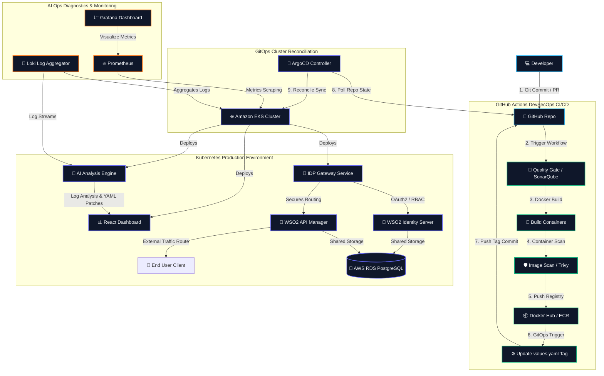
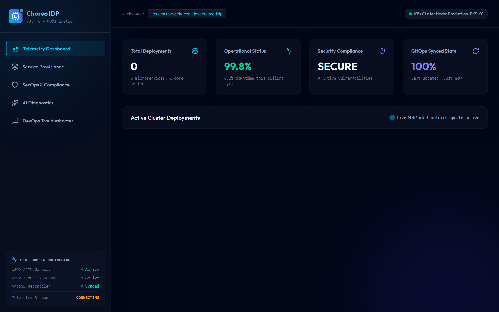
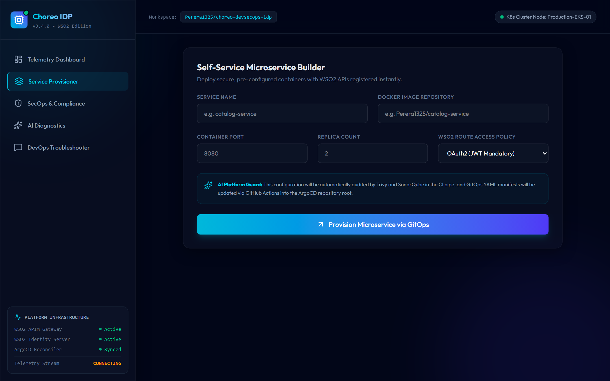
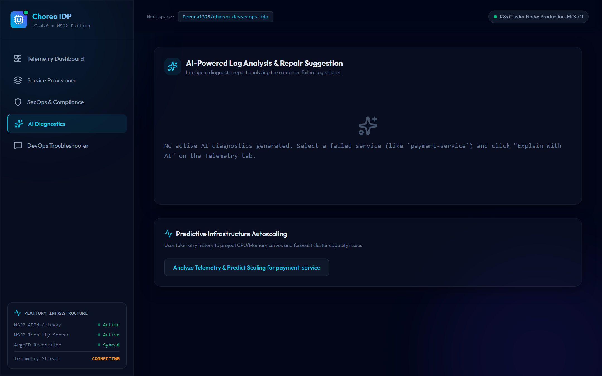
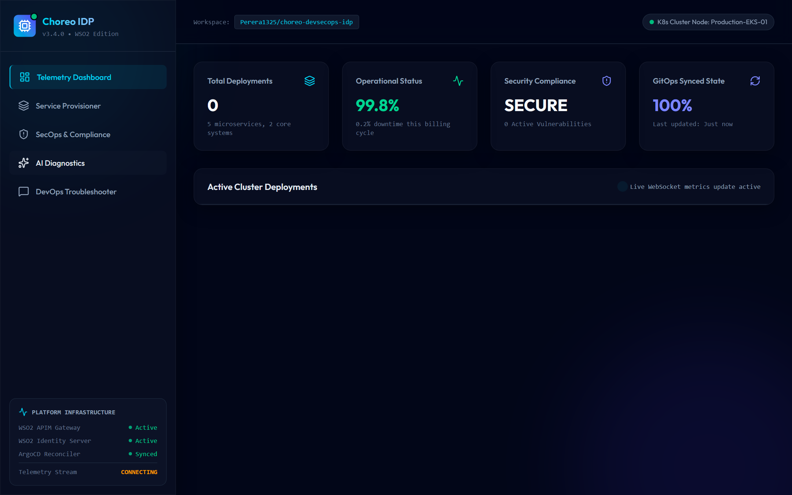

# Enterprise-Grade AI-Powered DevSecOps Internal Developer Platform (IDP)

[](https://github.com/Perera1325/choreo-devsecops-idp)
[](https://github.com/Perera1325/choreo-devsecops-idp)
[](https://github.com/Perera1325/choreo-devsecops-idp)
[](https://github.com/Perera1325/choreo-devsecops-idp)

An autonomous software delivery platform built to automate the entire software engineering lifecycle from local code commits to secure cloud-native production deployments. Powered by **WSO2 API Manager**, **WSO2 Identity Server**, **Kubernetes (EKS)**, and an **AI-driven diagnostics & auto-healing engine**, this platform represents modern enterprise GitOps and DevSecOps engineering.

🌐 **Live Hosted Platform**: [https://code-to-production-level.web.app](https://code-to-production-level.web.app)

---

## 🏛️ System Architecture

The following diagram illustrates the developer-to-production lifecycle flow and infrastructure layers:



---

## 📁 Repository Structure

```text
.
├── .github/
│   └── workflows/
│       └── ci-cd-pipeline.yml   # GHA CI pipeline (SonarQube, Trivy, GitOps update)
├── ansible/
│   ├── inventory.ini            # Infrastructure deployment target definitions
│   ├── playbook.yml             # Admin VM bootstrap and packages script
│   └── templates/
│       └── deployment.toml.j2   # WSO2 AM/IS configuration template
├── backend/
│   ├── src/
│   │   ├── services/
│   │   │   ├── ai.service.ts         # AI log diagnostics, chatbot & scale predictor
│   │   │   ├── deployment.service.ts # K8s deployment emulator (logs, heals, rollbacks)
│   │   │   └── security.service.ts   # Trivy & SonarQube reports aggregator
│   │   └── index.ts             # REST server & live telemetry WebSockets
│   ├── package.json
│   └── tsconfig.json
├── frontend/
│   ├── src/
│   │   ├── App.tsx              # React TS glassmorphic dashboard
│   │   ├── index.css            # Global CSS styling & glassmorphic layouts
│   │   └── main.tsx
│   ├── index.html
│   ├── package.json
│   ├── tailwind.config.js
│   └── vite.config.ts
├── helm/
│   └── idp-platform/
│       ├── Chart.yaml           # Platform release package descriptor
│       ├── values.yaml          # Default values (image registry, ports, resources)
│       └── templates/           # Ingress, Service, and Deployment manifests
├── kubernetes/
│   ├── argocd-app.yaml          # GitOps Root application definition
│   ├── wso2-apim-deployment.yaml # WSO2 API Manager StatefulSet deployment
│   └── wso2-is-deployment.yaml  # WSO2 Identity Server StatefulSet deployment
└── terraform/
    ├── main.tf                  # Provider configs (AWS, Kube, Helm)
    ├── variables.tf             # Configurable properties (Region, VPC CIDR)
    ├── vpc.tf                   # Multi-AZ VPC network setup
    ├── eks.tf                   # EKS cluster master plane & worker node group
    └── db.tf                    # Shared RDS PostgreSQL database for WSO2 config stores
```

---

## ⚡ Quick Start (Local Run & Validation)

For presentation or testing purposes, you can boot the entire platform (Frontend, Backend Services, Telemetry Streamers, and AI Simulator) locally.

### 1. Run the Backend Microservices
```bash
cd backend
npm install
npm run dev
```
The services boot on port `5000` exposing HTTP API and live WebSockets.

### 2. Run the React Frontend Dashboard
```bash
cd frontend
npm install
npm run dev
```
The dashboard compiles and runs on `http://localhost:5173`. Open this URL in your web browser.

---

## 🛠️ Infrastructure Provisioning Runbook

To run this in a production AWS cloud environment:

### Step 1: Provision Cloud Resources (Terraform)
1. Initialize and download the providers:
   ```bash
   cd terraform
   terraform init
   ```
2. Inspect the planned resources (VPC, EKS, RDS PostgreSQL):
   ```bash
   terraform plan
   ```
3. Apply configurations to AWS:
   ```bash
   terraform apply -auto-approve
   ```

### Step 2: Configure Virtual Machines & WSO2 configs (Ansible)
1. Configure credentials inside `ansible/inventory.ini`.
2. Run the playbook to install packages and template WSO2 configurations:
   ```bash
   cd ansible
   ansible-playbook -i inventory.ini playbook.yml
   ```

### Step 3: Deploy WSO2 & GitOps (Kubernetes)
1. Set up kubeconfig connection to EKS:
   ```bash
   aws eks update-kubeconfig --region us-east-1 --name devsecops-idp-cluster
   ```
2. Apply the WSO2 resources:
   ```bash
   kubectl apply -f kubernetes/wso2-is-deployment.yaml
   kubectl apply -f kubernetes/wso2-apim-deployment.yaml
   ```
3. Initialize the ArgoCD GitOps synchronizer:
   ```bash
   kubectl apply -f kubernetes/argocd-app.yaml
   ```

---

## 🧠 Integrated AI Features

This platform features a localized **AI Operations engine** which supports:
*   **Log Explanation & Analysis**: Submits real-time pod stderr or trace logs to Gemini or OpenAI, returning plain-english diagnostics.
*   **Automated Remediation**: Suggests corrected YAML patches (e.g., resource allocations, missing environment variables) ready to apply via GitOps.
*   **Predictive Autoscaling**: Tracks CPU metric histories and scales node replicas proactively before latency spikes occur.
*   **DevOps Troubleshooter**: A conversational helper that handles general queries on logs, WSO2 endpoints, or Kubernetes configurations.

To enable real-world LLM support, supply an API key in the backend environment variables:
```env
GEMINI_API_KEY="your-gemini-key"
# OR
OPENAI_API_KEY="your-openai-key"
```

---

## 📸 Platform Screenshots

> 🌐 All screenshots below are **real captures** from the live hosted platform at [https://code-to-production-level.web.app](https://code-to-production-level.web.app)

### 1. Unified Control Plane Dashboard
A glassmorphic dashboard showcasing real-time container states, active deployments, and automated self-healing events.


### 2. Services & Kubernetes Deployments View
Live deployment cards for all microservices — showing replica counts, CPU/memory usage, health status and one-click remediation controls.


### 3. Interactive DevOps Troubleshooting Assistant
An AI chatbot responding dynamically to platform failures, analyzing pods, and outputting remediated Kubernetes YAML changes.


### 4. Full Platform Overview (Scrolled)
Complete end-to-end view of the platform showcasing all integrated DevSecOps capabilities in one unified interface.


---

## 🏗️ Core Code Highlights

### 1. Dual-Sync (Firestore Cloud & Local WebSocket) Telemetry Client
The frontend dynamically uses cloud Firestore listeners for remote hosting deployments, automatically falling back to standard local WebSockets for offline sandbox testing:
```typescript
// App.tsx
useEffect(() => {
  let unsubscribeDeployments: (() => void) | null = null;
  try {
    if (db && !import.meta.env.VITE_FIREBASE_API_KEY?.includes("mock")) {
      // Connect to cloud database
      unsubscribeDeployments = onSnapshot(collection(db, "deployments"), (snapshot) => {
        const list: DeploymentInfo[] = [];
        snapshot.forEach((doc) => {
          list.push(doc.data() as DeploymentInfo);
        });
        if (list.length > 0) {
          setDeployments(list);
          setWsStatus('connected');
        }
      }, (err) => {
        setupWebSockets(); // WebSocket fallback on connection issue
      });
    } else {
      setupWebSockets(); // Default local offline mode
    }
  } catch (err) {
    setupWebSockets();
  }
}, []);
```

### 2. Autonomous Log Diagnosis & LLM Prompting
The platform analyzes standard log signatures with a heuristics engine, and triggers standard LLM calls via Gemini/OpenAI when api credentials are provided:
```typescript
// ai.service.ts
public static async explainFailure(logSnippet: string, deploymentYaml?: string): Promise<ExplanationResponse> {
  if (this.geminiApiKey) {
    try {
      return await this.callGeminiAPI(logSnippet, deploymentYaml);
    } catch (err) {
      console.error("Gemini API call failed, falling back to heuristics:", err);
    }
  }
  return this.analyzeLogHeuristically(logSnippet, deploymentYaml);
}
```

---

## 🤝 Contribution Guidelines

1. **Feature Branch**: Create a descriptive feature branch (`feature/add-prometheus-rules`).
2. **Commit Conventions**: Use structured commits (`feat(helm): add resource limits`).
3. **Verification**: Run unit tests and formatting before committing:
   ```bash
   npm --prefix ./frontend run lint
   npm --prefix ./backend run build
   ```
4. **Pull Request**: Open a PR targeting `main`. The CI pipeline will automatically trigger SonarQube quality gate and Trivy container image audits before merging.
